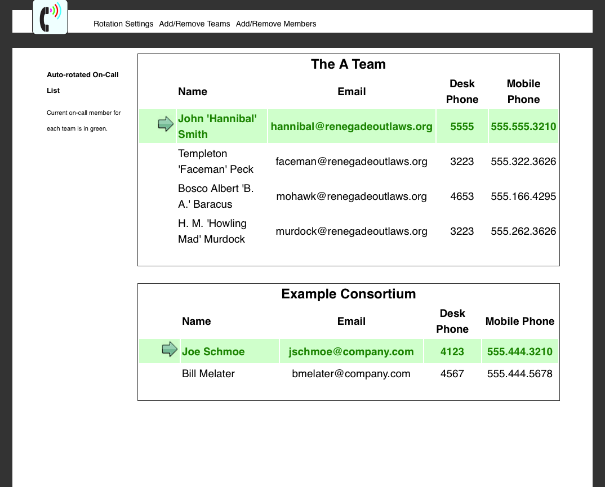

# Auto-rotating On-call List Application v0.03

### Current Working status: Working!

A Flask app that reads a JSON file with team info, and spits out an on-call list for each team
based on the team's roster JSON file and the current date.

### Screenshot

The `logo.svg` and `yes.png`  are both public domain works. Feel free to replace those.

### Installation

Set up a Python3 virtualenv, `pip install -r requirements.txt`

### Configuration files

There's an example `teams.json` file that you can use to build your own `teams.json`, which is required to run the app. Each team will also need a json file with the members.  See `the A.json` and `example.json` for examples for how to configure those. 
